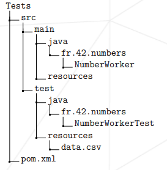
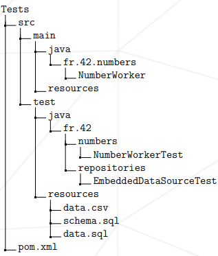
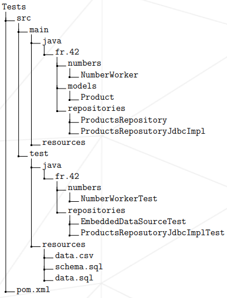
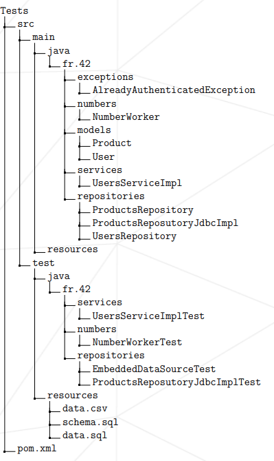

# Java Module 06 – JUnit & Mockito

## Project Overview
End-to-end mini-project to learn unit tests, integration tests, and mock-based service tests across four progressive exercises.

## Learning Flow
```
[ Pure logic tests ]
        ↓
[ In-memory DB + DataSource ]
        ↓
[ JDBC Repository + CRUD tests ]
        ↓
[ Service layer + Mockito mocks ]
```

## Features
- Pure logic unit testing with JUnit 5
- In-memory database integration testing with HSQLDB
- JDBC repository CRUD tests against a real schema and data set
- Service-layer unit testing with Mockito

## Tech Stack
- JUnit 5
- Mockito
- HSQLDB (embedded)
- Spring JDBC (EmbeddedDatabaseBuilder)
- Java + JDBC

## Exercises

### Exercise 00 – NumberWorker (Pure Logic + Parameterized Tests)
**Goal:** Learn basic JUnit 5, parameterized tests, and CSV-driven tests.

**Core class:** `NumberWorker`
- `boolean isPrime(int number)`
  - Returns `true` if number is prime
  - Throws `IllegalNumberException` for number `<= 1`
- `int digitsSum(int number)`
  - Returns sum of digits (e.g., 1234 -> 10)

**Test ideas:** `NumberWorkerTest`
- `@ParameterizedTest @ValueSource(ints = {2, 3, 5, 7, 11})` -> all are prime
- `@ParameterizedTest @ValueSource(ints = {4, 6, 8, 9, 12})` -> all are not prime
- `@ParameterizedTest @ValueSource(ints = {-10, -1, 0, 1})` -> throws `IllegalNumberException`
- `@ParameterizedTest @CsvFileSource(resources = "/data.csv", numLinesToSkip = 1)`
  - `data.csv` contains: `number,digitsSum`
  - Example row: `1234,10` -> assert `digitsSum(1234) == 10`

### Exercise 01 – Embedded HSQLDB DataSource
**Goal:** Use an in-memory database (HSQLDB) for tests instead of a heavy DB.

**Files:**
- `schema.sql` defines the product table structure (columns: `id`, `name`, `price`)
- `data.sql` inserts at least 5 product rows

**Test class:** `EmbeddedDataSourceTest`
- Use `EmbeddedDatabaseBuilder` (Spring JDBC) with `schema.sql` and `data.sql`
- In `@BeforeEach`, build a new in-memory DB for a clean state per test
- Test that `dataSource.getConnection()` returns a non-null connection

### Exercise 02 – ProductsRepository (JDBC + Integration Tests)
**Goal:** Implement a JDBC repository and test it using the embedded HSQLDB.

**Interface:** `ProductsRepository`
- `List<Product> findAll()`
- `Optional<Product> findById(Long id)`
- `void update(Product product)`
- `void save(Product product)`
- `void delete(Long id)`

**Implementation highlights:** `ProductsRepositoryJdbcImpl`
- Uses the `DataSource` from Exercise 01
- Standard JDBC pattern with try-with-resources

```java
try (Connection con = dataSource.getConnection();
     PreparedStatement ps = con.prepareStatement(SQL)) {
    // bind params
    // execute
}
```

**SQL examples (concept):**
- `findAll`: `SELECT id, name, price FROM product`
- `findById`: `SELECT id, name, price FROM product WHERE id = ?`
- `update`: `UPDATE product SET name = ?, price = ? WHERE id = ?`
- `save`: `INSERT INTO product (name, price) VALUES (?, ?)` with `RETURN_GENERATED_KEYS`
- `delete`: `DELETE FROM product WHERE id = ?`

**Test class:** `ProductsRepositoryJdbcImplTest`
- Rebuilds the embedded DB before each test
- Predefined expected products, such as:
  - `EXPECTEDFINDALLPRODUCTS`
  - `EXPECTEDFINDBYIDPRODUCT`
  - `EXPECTEDUPDATEDPRODUCT`
- Tests: `testFindAll`, `testFindById`, `testUpdate`, `testSave`, `testDelete`

### Exercise 03 – UsersService + Mockito (Service-Level Unit Tests)
**Goal:** Test business logic in `UsersServiceImpl` without touching a real database. Use Mockito to fake the repository.

**Domain:**
- `User`: `id`, `login`, `password`, `authenticated`
- `UsersRepository`: `User findByLogin(String login)` (throws `EntityNotFoundException` if not found), `void update(User user)`
- `AlreadyAuthenticatedException`: thrown when a user tries to authenticate but is already authenticated

**Service:** `UsersServiceImpl`
```java
public class UsersServiceImpl {
    private final UsersRepository usersRepository;

    public UsersServiceImpl(UsersRepository usersRepository) {
        this.usersRepository = usersRepository;
    }

    public boolean authenticate(String login, String password) {
        User user = usersRepository.findByLogin(login); // may throw EntityNotFoundException

        if (user.isAuthenticated()) {
            throw new AlreadyAuthenticatedException(user.getLogin() + " already authenticated");
        }

        if (user.getPassword().equals(password)) {
            user.setAuthenticated(true);
            usersRepository.update(user);
            return true;
        } else {
            return false;
        }
    }
}
```

**Test class with Mockito:** `UsersServiceImplTest`
```java
@ExtendWith(MockitoExtension.class)
public class UsersServiceImplTest {

    @Mock
    private UsersRepository usersRepository;

    @InjectMocks
    private UsersServiceImpl usersServiceImpl;

    @Test
    void testAuthenticateCorrectLoginAndPassword() {
        User user = new User(1L, "oobbad", "hello123", false);

        when(usersRepository.findByLogin("oobbad")).thenReturn(user);

        boolean result = usersServiceImpl.authenticate("oobbad", "hello123");

        assertTrue(result);
        assertTrue(user.isAuthenticated());
        verify(usersRepository).update(user);
    }

    // other tests: incorrect login, incorrect password...
}
```

## Installation
- Add JDK version requirement here
- Add build tool requirement here (e.g., Maven version)

## Setup Instructions
1. Clone the repository
2. Navigate to the module directory
3. Add your build and test commands here

## Environment Variables
- None

## Usage
- Add how to run tests here
- Add how to run exercises here

## Folder Structure
```
ex00/
    
ex01/
    
ex02/
    
ex03/
    
```

## Deployment
- Not applicable (educational module)

## Screenshots


## Contributing
- Add contribution guidelines here

## License
- Add license name or file reference here

## Contact
- Add maintainer or author contact here